# Event-Driven Document Management System

<p align="center">
  
  
  
  
</p>

## Overview

A high-performance document management system built on a **microservices architecture**, featuring **event-driven** patterns, **Change Data Capture (CDC)**, and real-time updates. This project demonstrates advanced  concepts using **Async Python (FastAPI)**, **Kafka**, **Elasticsearch**, and **Redis**.

## Key Features

*   **Microservices Architecture**: Modular services for Documents, Signatures, Search, and Quality.
*   **Event-Driven Design**: Asynchronous communication via Apache Kafka.
*   **Change Data Capture (CDC)**: Real-time database monitoring using Debezium and PostgreSQL WAL.
*   **Full-Text Search**: Scalable search engine powered by Elasticsearch.
*   **High Performance**: Fully asynchronous I/O using FastAPI and `asyncpg`.
*   **Real-time Analytics**: View counting and unique visitors using Redis HyperLogLog.
*   **S3-Compatible Storage**: Document storage using MinIO.

## Architecture

<p align="center">
  
</p>

### Detailed System Design

```mermaid
graph TB
    subgraph "Client Layer"
        Browser["🌐 Web Browser<br/>React/Vue/Angular"]
        Mobile["📱 Mobile App<br/>iOS/Android"]
        CLI["💻 CLI Tool<br/>curl/httpie"]
    end

    subgraph "Gateway Layer"
        Nginx["🌐 Reverse Proxy<br/>(Nginx/Kong)<br/>Port 8000"]
    end

    subgraph "Microservices Layer"
        DocSvc["🐍 Document Service<br/>FastAPI (AsyncIO)<br/>Port 8000 (HTTP)<br/>Port 50051 (gRPC)"]
        
        SigSvc["🐍 Signature Service<br/>FastAPI (AsyncIO)<br/>Port 8000"]
        
        SearchSvc["🐍 Search Service<br/>FastAPI (AsyncIO)<br/>Port 8000"]
        
        QualitySvc["🐍 Data Quality Service<br/>(Quix Streams)"]
    end

    subgraph "Data Persistence Layer"
        PG[("🐘 PostgreSQL 15<br/>Port 5432<br/>WAL Enabled")]
        
        Redis[("🔴 Redis 7<br/>Port 6379<br/>Cache & Analytics")]
        
        MinIO[("📦 MinIO<br/>Port 9000<br/>S3 Storage")]
    end

    subgraph "Event Backbone"
        Kafka["📨 Apache Kafka<br/>Port 9092"]
        Debezium["🔄 Debezium Connect<br/>Port 8083"]
    end

    subgraph "Search Engine"
        ES[("🔍 Elasticsearch 8<br/>Port 9200")]
    end

    %% Client Interactions
    Browser --> Nginx
    CLI --> Nginx
    Nginx --> DocSvc
    Nginx --> SigSvc
    Nginx --> SearchSvc

    %% Service Interactions
    DocSvc -->|"SQL"| PG
    SigSvc -->|"SQL"| PG
    DocSvc -->|"S3"| MinIO
    DocSvc -->|"Cache"| Redis

    %% Event Flow
    PG -->|"WAL"| Debezium
    Debezium -->|"CDC Events"| Kafka
    Kafka -->|"Consume"| SearchSvc
    Kafka -->|"Consume"| QualitySvc
    QualitySvc -->|"Search Indexing"| ES
```



## Prerequisites

Before starting, ensure you have the following installed:

*   **Docker** and **Docker Compose**
*   **cURL** and **jq** (for testing APIs)
*   **Python 3.11+** (optional, for local development)

## Getting Started

### 1. Clone the Repository
```bash
git clone https://github.com/EbEmad/event-driven-dms.git
cd event-driven-dms
```

### 2. Environment Setup
Create the `.env` file from the example template. The default values are sufficient for local development.

```bash
cp .env.example .env
```

### 3. Start Services
Launch the entire stack using Docker Compose. This might take a few minutes on the first run as images are built.

```bash
docker-compose up -d --build
```

### 4. Verify Installation
Check if all containers are running and healthy:

```bash
docker-compose ps
```

## Services Overview

| Service | Port (Host) | Description |
| :--- | :--- | :--- |
| **Document Service** | `8005` | Core CRUD operations for documents. |
| **Signature Service** | `8002` | Handles document signing via gRPC. |
| **Search Service** | `8001` | Read-only search API (if exposed). |
| **Kafka UI** | `8080` | Web interface to monitor Kafka topics and brokers. |
| **MinIO Console** | `9001` | Object storage management (S3). |
| **Debezium** | `8083` | CDC Connector API. |
| **Elasticsearch** | `9200` | Search engine API. |

## Comprehensive API Guide

Follow these steps to exercise the full system capabilities using `curl`.

### 1. Document Service

**Create a Document**
```bash
# Returns the new document ID (save this!)
curl -X POST http://localhost:8005/documents \
  -H "Content-Type: application/json" \
  -d '{
    "title": "Service Level Agreement 2024",
    "content": "This agreement defines the terms of service...",
    "created_by": "admin@example.com"
  }' | jq '.'
```

**Get Document Details**
```bash
# Replace <DOC_ID> with the ID from above
curl http://localhost:8005/documents/<DOC_ID> | jq '.'
```

**Get Document Analytics**
```bash
curl http://localhost:8005/documents/<DOC_ID>/stats | jq '.'
```

### 2. Signature Service

**Sign a Document**
This triggers a gRPC call to the Document Service to update the status to "signed" and initiates an event chain.

```bash
curl -X POST http://localhost:8002/signatures \
  -H "Content-Type: application/json" \
  -d '{
    "document_id": "<DOC_ID>",
    "signer_email": "client@example.com",
    "signer_name": "John Doe",
    "signature_data": "base64_encoded_signature_string",
    "document_status": "signed"
  }' | jq '.'
```

### 3. Search Service

**Search by Keyword**
The search service uses Elasticsearch to find documents. Note that indexing is asynchronous, so there might be a slight delay (ms) after creation.

```bash
# Search for "Agreement"
curl "http://localhost:8005/search?q=Agreement" | jq '.'
```

**Advanced Filtering**
```bash
# Search for signed documents created by admin
curl "http://localhost:8005/search?q=Agreement&status=signed&created_by=admin@example.com" | jq '.'
```

### 4. Data Quality & Analytics (Automated)

The **Data Quality Service** runs in the background. It consumes document creation events, validates the content (using an LLM provider if configured), and enriches the metadata.

You can verify its output by checking the Kafka topics via **Kafka UI** at `http://localhost:8080` or by inspecting the enriched data in Elasticsearch:

```bash
curl "http://localhost:9200/documents/_search?q=quality_score:>0" | jq '.'
```

## Redis Analytics

The system uses Redis for high-speed, atomic capability counting.

*   **View Statistics**: `GET views:{doc_id}`
*   **Unique Visitors**: `PFCOUNT unique_views:{doc_id}`

## Project Structure

```
├── services/               # Microservices source code
│   ├── document/           # Document management service
│   ├── signature/          # Digital signature service
│   ├── search/             # Search service (FastAPI)
│   ├── event/              # Event processor (Quix Streams)
│   └── data-quality/       # Data validation service
├── debezium/               # Debezium connector configurations
├── scripts/                # Database and setup scripts
└── docker-compose.yml      # Orchestration configuration
```

## Contributing

Contributions are welcome! Please feel free to submit a Pull Request.