# Event-Driven Document Management System

<p align="center">
  
  
  
  
</p>

##  Overview

A microservices architecture showing event-driven document management with Change Data Capture (CDC), real-time updates, and full-text search capabilities. Built entirely with **async Python** for maximum throughput and minimal resource consumption.

##  Architecture

### High-Level Flow

### Detailed Architecture Diagram

```mermaid
graph TB
    subgraph "Client Layer"
        Browser["🌐 Web Browser<br/>React/Vue/Angular"]
        Mobile["📱 Mobile App<br/>iOS/Android"]
        CLI["💻 CLI Tool<br/>curl/httpie"]
    end

    subgraph "API Gateway Layer"
        Kong["🦍 Kong Gateway<br/>Port 8000 (Proxy)<br/>Port 8001 (Admin)<br/>━━━━━━━━━━<br/>• Request Routing<br/>• CORS Handling<br/>• Load Balancing<br/>• WebSocket Proxy"]
    end

    subgraph "Microservices Layer"
        DocSvc["🐍 Document Service<br/>FastAPI (AsyncIO)<br/>Port 8000 (HTTP)<br/>Port 50051 (gRPC)<br/>━━━━━━━━━━<br/>• Create Documents<br/>• Update Status<br/>• Analytics Tracking<br/>• gRPC Server"]
        
        SigSvc["🐍 Signature Service<br/>FastAPI (AsyncIO)<br/>Port 8000<br/>━━━━━━━━━━<br/>• Create Signatures<br/>• Validate Signers<br/>• gRPC Client<br/>• Update Doc Status"]
        
        SearchSvc["🐍 Search Service<br/>FastAPI (AsyncIO)<br/>Port 8000<br/>━━━━━━━━━━<br/>• Full-text Search<br/>• Aggregations<br/>• Read-only"]
        
        WSSvc["🐍 WebSocket Service<br/>FastAPI (AsyncIO)<br/>Port 8000<br/>━━━━━━━━━━<br/>• Real-time Updates<br/>• JWT Authentication<br/>• Connection Manager<br/>• Kafka Consumer"]
    end

    subgraph "Connection Pooling"
        PgBouncer["🎱 PgBouncer<br/>Port 6432<br/>━━━━━━━━━━<br/>Transaction Pooling<br/>• Max 1000 clients<br/>• Pool size: 50<br/>• Reserve: 10<br/>• Auth: scram-sha-256"]
    end

    subgraph "Data Persistence Layer"
        PG[("🐘 PostgreSQL 15<br/>Port 5432<br/>━━━━━━━━━━<br/>• Documents Table<br/>• Signatures Table<br/>• REPLICA IDENTITY FULL<br/>• Logical Replication<br/>━━━━━━━━━━<br/>Config:<br/>• wal_level = logical<br/>• max_connections = 200")]
        
        Redis[("🔴 Redis 7<br/>Port 6379<br/>━━━━━━━━━━<br/>• Document Cache (TTL)<br/>• Analytics Counters<br/>• HyperLogLog (unique views)<br/>• volatile-lru eviction<br/>• AOF persistence")]
        
        MinIO[("📦 MinIO<br/>Port 9000 (API)<br/>Port 9001 (Console)<br/>━━━━━━━━━━<br/>S3-Compatible Storage<br/>• Document Content<br/>• Signature Images<br/>• Bucket: documents")]
    end

    subgraph "CDC Pipeline"
        Debezium["🔄 Debezium Connect<br/>Port 8083<br/>━━━━━━━━━━<br/>PostgreSQL Connector<br/>• Reads WAL Stream<br/>• Captures Changes<br/>• Publishes to Kafka<br/>• pgoutput plugin"]
        
        Kafka["📨 Apache Kafka<br/>Port 9092<br/>━━━━━━━━━━<br/>Event Streaming<br/>Topics:<br/>• cdc.documents<br/>• cdc.signatures<br/>━━━━━━━━━━<br/>Single broker (dev)"]
    end

    subgraph "Event Processing Layer"
        EventProc["⚙️ Event Processor<br/>Quix Streams<br/>━━━━━━━━━━<br/>Background Worker<br/>• Transform CDC events<br/>• Filter incomplete data<br/>• Batch to Elasticsearch<br/>• Idempotent indexing"]
    end

    subgraph "Search Engine"
        ES[("🔍 Elasticsearch 8<br/>Port 9200<br/>━━━━━━━━━━<br/>Full-text Search<br/>Index: documents<br/>• Title (analyzed)<br/>• Status (keyword)<br/>• Aggregations")]
    end

    %% Client to Gateway (HTTP)
    Browser -->|"HTTP Requests"| Kong
    Mobile -->|"HTTP Requests"| Kong
    CLI -->|"HTTP Requests"| Kong

    %% Client to Gateway (WebSocket - Bidirectional)
    Browser <-->|"WebSocket<br/>(persistent)"| Kong
    Mobile <-->|"WebSocket<br/>(persistent)"| Kong

    %% Gateway to Services (HTTP)
    Kong -->|"POST /documents<br/>GET /documents"| DocSvc
    Kong -->|"POST /signatures"| SigSvc
    Kong -->|"GET /search?q=..."| SearchSvc
    
    %% Gateway to WebSocket Service (Bidirectional)
    Kong <-->|"WS /ws/{doc_id}<br/>(bidirectional)"| WSSvc

    %% Services to Connection Pool
    DocSvc -->|"SQL Queries<br/>(asyncpg)"| PgBouncer
    SigSvc -->|"SQL Queries<br/>(asyncpg)"| PgBouncer
    
    %% PgBouncer to PostgreSQL
    PgBouncer -->|"50 pooled<br/>connections"| PG

    %% Services to Cache/Analytics
    DocSvc -->|"Cache + Analytics<br/>(aioredis)"| Redis

    %% Services to Storage
    DocSvc -->|"PUT/GET<br/>(aioboto3)"| MinIO
    SigSvc -->|"PUT<br/>(aioboto3)"| MinIO

    %% gRPC Communication
    SigSvc -.->|"gRPC Call<br/>UpdateDocumentStatus"| DocSvc

    %% CDC Pipeline (bypasses PgBouncer)
    PG -->|"WAL Stream<br/>(logical replication)"| Debezium
    Debezium -->|"Publish CDC Events<br/>(JSON)"| Kafka

    %% Event Consumers
    Kafka -->|"Subscribe<br/>cdc.documents"| EventProc
    Kafka -->|"Subscribe<br/>cdc.documents<br/>cdc.signatures"| WSSvc

    %% Event Processing to Search
    EventProc -->|"Bulk Index<br/>(async)"| ES

    %% Search Service to Elasticsearch
    SearchSvc -->|"Search Queries<br/>(async)"| ES

    %% Styling
    classDef clientStyle fill:#e1f5ff,stroke:#01579b,stroke-width:2px
    classDef gatewayStyle fill:#fff3e0,stroke:#e65100,stroke-width:3px
    classDef serviceStyle fill:#f3e5f5,stroke:#4a148c,stroke-width:2px
    classDef dataStyle fill:#e8f5e9,stroke:#1b5e20,stroke-width:2px
    classDef cdcStyle fill:#fff9c4,stroke:#f57f17,stroke-width:2px
    classDef searchStyle fill:#fce4ec,stroke:#880e4f,stroke-width:2px

    class Browser,Mobile,CLI clientStyle
    class Kong gatewayStyle
    class DocSvc,SigSvc,SearchSvc,WSSvc serviceStyle
    class PG,Redis,MinIO,PgBouncer dataStyle
    class Debezium,Kafka,EventProc cdcStyle
    class ES searchStyle
```


## Testing with Curl

You can test the flow (Document Creation -> Signature -> Status Update) using the following commands.

### 1. Create a Document
**Service:** Document Service (Port 8005)

**Option A: Inline JSON**
```bash
curl -X POST http://localhost:8005/documents \
  -H "Content-Type: application/json" \
  -d '{
    "title": "Sales Agreement Q4 2025",
    "content": "This agreement outlines the terms...",
    "created_by": "ebemad@company.com"
  }' | jq '.'
```


**Option B: Using a JSON File (S3 Upload)**
```bash
curl -X POST http://localhost:8005/documents \
  -H "Content-Type: application/json" \
  -d @sample_doc.json | jq '.'
```
*Response:* Note the `id` field from the response (e.g., `06946681-6080-71f1-8000-e0ba48255d59`).

### 2. Sign the Document
**Service:** Signature Service (Port 8002)
**Trigger:** This will trigger a gRPC call to update the document status to `signed`.

Replace `YOUR_DOCUMENT_ID` with the ID from Step 1.

```bash
curl -X POST http://localhost:8002/signatures \
  -H "Content-Type: application/json" \
  -d '{
    "document_id": "YOUR_DOCUMENT_ID",
    "signer_email": "ebemad@client.com",
    "signer_name": "Ebrahim Emad",
    "signature_data": "base64encoded_signature_image_data_here",
    "document_status":"pending"
  }' | jq '.'
```

### 3. Verify Document Status
**Service:** Document Service (Port 8005)

Check that the document status has been updated to `signed`.

```bash
curl http://localhost:8005/documents/YOUR_DOCUMENT_ID | jq '.'
```


## Redis Cache & Analytics

### API Endpoints (Recommended)
```bash
# Get document statistics
curl http://localhost:8005/documents/YOUR_DOCUMENT_ID/stats | jq '.'

# Fetch document (triggers view tracking)
curl http://localhost:8005/documents/YOUR_DOCUMENT_ID | jq '.'
```

### Direct Redis Inspection

**One-liner commands:**
```bash
# List all cached documents
docker exec -it docs-redis redis-cli KEYS "document:*"

# Get cached document
docker exec -it docs-redis redis-cli GET "document:YOUR_DOCUMENT_ID"

# Get view count
docker exec -it docs-redis redis-cli GET "views:YOUR_DOCUMENT_ID"

# Get unique visitors
docker exec -it docs-redis redis-cli PFCOUNT "unique_views:YOUR_DOCUMENT_ID"
```

**Interactive mode:**
```bash
docker exec -it docs-redis redis-cli
# Then: KEYS *, GET "key", TTL "key", EXIT
```

